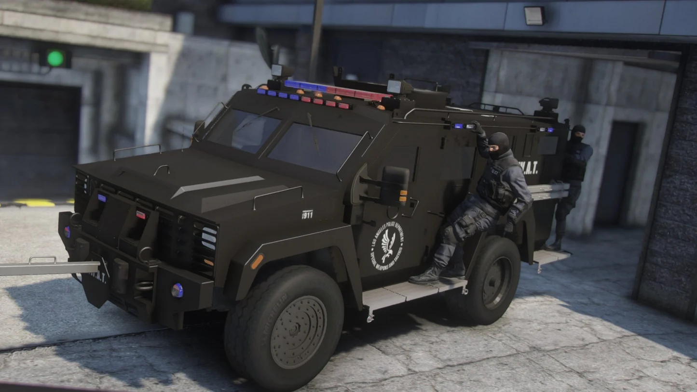
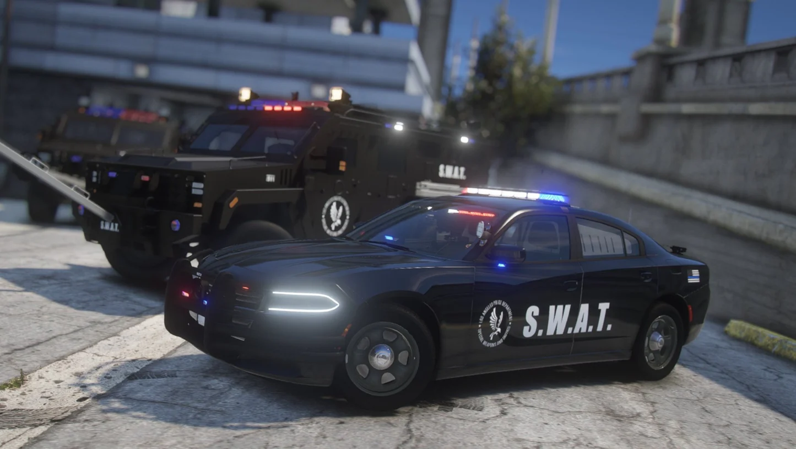
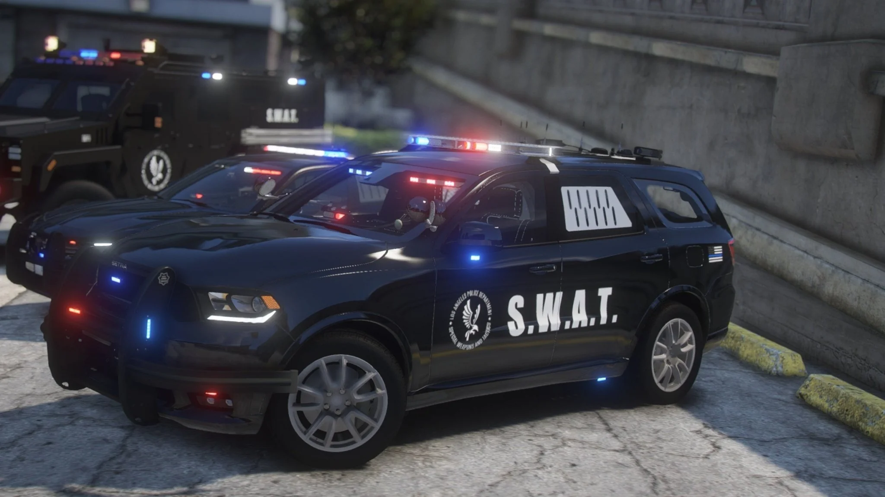

# 🚓 SWAT Debadged Police Pack – FiveM Ready

A high-quality **FiveM SWAT Car Pack** featuring 5 fully debadged and optimized vehicles. Perfect for roleplay servers needing tactical units with a clean, professional look.

> 🔗 **Download Pack via Discord:** [Join here](https://discord.gg/B9AXxWQUd5)

---

## 📦 What's Included?

This pack contains **5 non-ELS SWAT vehicles**, fully optimized and tested for FiveM. Each vehicle comes ready-to-use — just drag and drop into your server!

### ✅ Features:
- 🔧 **Easy to Install** – FiveM drag-and-drop ready
- 💡 **Realistic Lighting** – immersive emergency lights setup
- 🚨 **Rotatable Spotlight** – control with **Shift + Ctrl**
- 🛡️ **Bearcat Ram-Bar** – movable up and down with **Shift + Ctrl**
- 🚘 **Realistic Handlings** – smooth and authentic vehicle behavior
- 🏷️ **Debadged Models** – clean, unmarked tactical design
- 📐 **Templates Included** – for easy custom liveries
- 🖼️ **High Quality Models** – crisp details and optimized textures

---

## 📸 Screenshots
<details>
  <summary>📸 Click to view SWAT Pack Screenshots</summary>





</details>

---

## 🚀 Installation Guide

1. Download the pack via our [Discord Server](https://discord.gg/B9AXxWQUd5)
2. Drag and drop the vehicle folders into your server’s `resources` folder
3. Add the vehicles to your `server.cfg`:
   ```cfg
      ensure swat
   ````

4. Restart your server and enjoy!


## 📢 Join the Community

Need support or want more high-quality FiveM content?

🟢 **Join our Discord:** [NeoFive Community](https://discord.gg/B9AXxWQUd5)


## 🛑 Terms of Use

* Do not re-upload or redistribute outside our Discord.
* Do not claim the models as your own.
* All rights reserved to original creators where applicable.


**Made with ❤️ for the FiveM community.**
